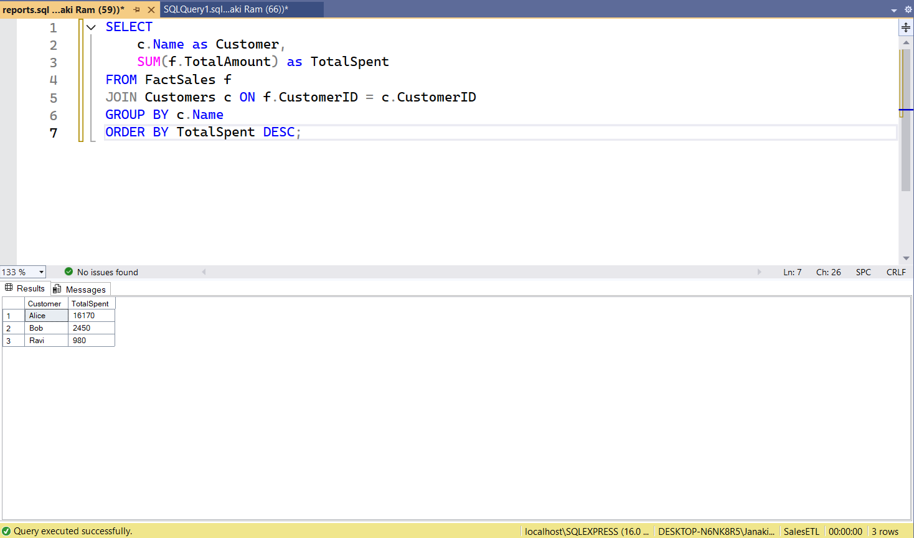

# 📊 ETL Pipeline for Sales & Customer Analytics  
A complete end-to-end ETL pipeline built using **Python, MS-SQL Server, Pandas, and SQLAlchemy**.  
This project demonstrates ETL concepts including staging, dimensional modeling, lookups, fact table creation, and SQL reporting.

---

## 🏗️ Architecture Overview
```
CSV Files → RawSales (Staging) → Dimensions → FactSales → SQL Reports
```

---

## 🛠️ Tech Stack
- **Python** (pandas, sqlalchemy, pyodbc)
- **MS-SQL Server**
- **SQL (Joins, Aggregations, Fact/Dimension Modeling)**
- **GitHub**
- **VS Code**

---

## 📁 Project Structure
```
etl-sales-analytics/
│
├── data/
│   ├── sales_raw.csv
│   ├── customers.csv
│   └── products.csv
│
├── etl/
│   ├── load_raw.py
│   ├── load_dimensions.py
│   └── load_facts.py
│
├── sql/
│   ├── create_tables.sql
│   └── reports.sql
│
└── README.md
```

---

## 🚀 ETL Pipeline Steps

### **1️⃣ Phase A — Setup**
- Created raw CSV datasets  
- Designed SQL database with **staging**, **dimensions**, and **fact** tables

### **2️⃣ Phase B — Load Raw Data**
- Loaded `sales_raw.csv` into `RawSales` table using `pandas` + `SQLAlchemy`

### **3️⃣ Phase C — Transform & Load**
- Loaded customers and products into dimension tables  
- Performed lookups to map `CustomerID` & `ProductID`  
- Inserted transformed data into `FactSales`  

### **4️⃣ Phase D — Reporting**
Generated analytics using SQL including:
- Total daily sales  
- Top selling products  
- Customer spending analysis  

---

# 📊 SQL Reports (Analytics)

### **1️⃣ Total Sales Per Day**
```sql
SELECT 
    SaleDate,
    SUM(TotalAmount) AS DailySales
FROM FactSales
GROUP BY SaleDate
ORDER BY SaleDate;
```

📸 **Output Screenshot**


---

### **2️⃣ Top Selling Products**
```sql
SELECT 
    p.Name AS Product,
    SUM(f.Quantity) AS TotalQty
FROM FactSales f
JOIN Products p ON f.ProductID = p.ProductID
GROUP BY p.Name
ORDER BY TotalQty DESC;
```

📸 **Output Screenshot**


---

### **3️⃣ Customer Spending Analysis**
```sql
SELECT 
    c.Name AS Customer,
    SUM(f.TotalAmount) AS TotalSpent
FROM FactSales f
JOIN Customers c ON f.CustomerID = c.CustomerID
GROUP BY c.Name
ORDER BY TotalSpent DESC;
```

📸 **Output Screenshot**


---

# 🖼️ How to Add Your Output Images

1. Create a folder in your repo:
```
images/
```

2. Save your screenshots as:
```
images/daily_sales.png
images/top_products.png
images/customer_spending.png
```

3. Add/commit/push the images to GitHub.

4. Ensure your README contains:

```markdown


```

---

# 🎯 Final Outcome
- ✔ Complete ETL pipeline  
- ✔ Staging + Dimensions + Fact table  
- ✔ Python automation for loading  
- ✔ SQL reporting for analytics  
- ✔ Ideal for **Business Analyst + Developer** role  
- ✔ Perfect portfolio-ready project  

---

# 👨‍💻 Author
**Kusu Janakiram**  
GitHub: https://github.com/janakiramkusu  
Portfolio: https://janakiramkusu.github.io/portifolio/
